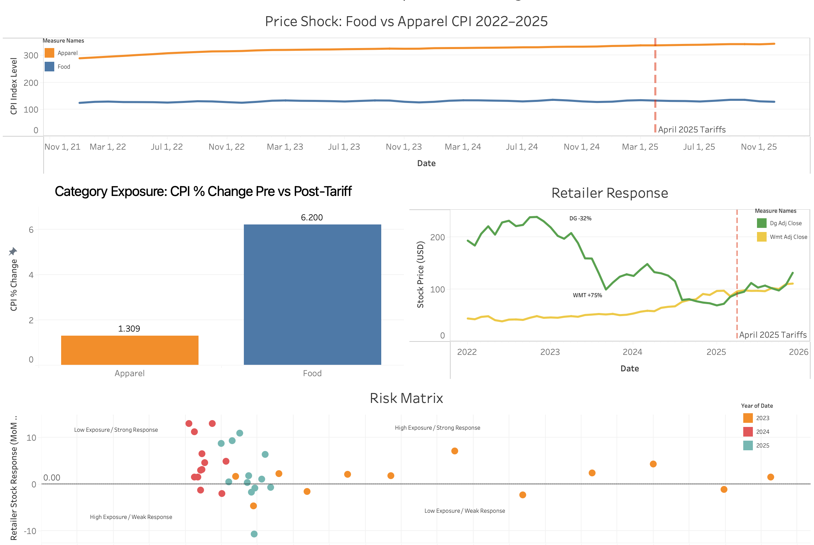

# The Tariff Tax on Your Cart
### Analyzing Consumer Price and Retailer Performance During the April 2025 US Tariff Wave

**Brianna Chau** | UBC Economics & Data Science  
📊 [Live Tableau Dashboard](https://public.tableau.com/views/TariffConsumerAnalysisDashboard/TariffConsumerAnalysisDashboard?:language=en-US&publish=yes&:sid=&:redirect=auth&:display_count=n&:origin=viz_share_link)  
🗓️ Data window: January 2022 – December 2025



---

## Objective

Determine whether consumer prices, sentiment, and retailer stock performance exhibited meaningful changes during the April–December 2025 tariff period, and what those changes suggest for sourcing and pricing decisions at a mid-size Canadian retailer.

---

## Background

In April 2025, the United States implemented a broad new round of tariffs on imported goods. For Canadian retailers with US-linked supply chains, the downstream question was which product categories would absorb cost increases, how quickly consumers would respond, and whether any retailer type was structurally better positioned to weather the shock.

This project uses publicly available economic data to explore those questions. The analysis is framed as a recommendation to a supply chain director at a mid-size Canadian retailer deciding where to focus pricing and sourcing reviews in H2 2025.

This is an event-window analysis. April 2025 is used as the tariff boundary because it marks the announced effective date of the broad US tariff package. Observed changes post-April 2025 coincide with the tariff timeline but cannot be attributed solely to tariffs without controlling for concurrent macroeconomic variables. Where the data permits, alternative explanations are tested explicitly.

---

## Methodology

1. Collected monthly CPI (food and apparel), consumer sentiment, and retailer stock data via FRED API and Alpha Vantage
2. Cleaned and standardized all series to a common monthly grain
3. Merged into a single master dataset (48 rows × 13 columns)
4. Defined April 2025 as the tariff event boundary based on the announced effective date
5. Compared pre-tariff (Jan 2022 – Mar 2025) and post-tariff (Apr – Dec 2025) period averages
6. Tested alternative explanations for observed changes and documented data limitations explicitly

---

## Data Pipeline
```
FRED API                    Alpha Vantage
(CPI Food, CPI Apparel,     (WMT, DG monthly
Consumer Sentiment)         adjusted close)
│                          │
└────────────┬─────────────┘
             ▼
     Python ETL (pandas)
     notebooks/01_collection.py
     notebooks/02_cleaning.py
             │
             ▼
      SQLite database
             │
             ▼
  data/processed/cleaned_data.csv
     (48 rows × 13 cols)
             │
             ▼
   Tableau Public Dashboard
```

---

## Hypotheses

Three hypotheses were stated before examining the data:

**H1 — Food prices would rise more sharply than apparel post-tariff**  
Food supply chains have higher import dependence in agricultural inputs and shorter inventory cycles, making them faster to reprice. Apparel retailers typically carry longer forward inventory positions, providing a temporary buffer.

**H2 — Consumer sentiment would decline as prices eroded purchasing power**  
Higher food prices directly affect household budgets, particularly for lower-income consumers. Sentiment surveys tend to respond quickly to visible price changes at the grocery level.

**H3 — Discount retailers would outperform premium retailers post-tariff**  
A consumer spending squeeze typically benefits value-oriented retailers as households trade down to lower-cost channels. Dollar General was expected to benefit; Walmart less so.

---

## Signal Confidence

Before reading the findings, here is how much weight to put on each result:

| Signal | Confidence | Reason |
|---|---|---|
| Consumer sentiment decline | **Strong** | Sustained across all 9 post-tariff months, unambiguous direction |
| Food vs apparel CPI gap | **Strong** | 4.9 pp divergence is hard to explain with a single broad macro cause |
| Sustained food CPI level | **Moderate** | Elevated above pre-tariff trend, but monthly rate did not re-accelerate |
| WMT / DG stock divergence | **Moderate** | Direction clear but magnitude depends heavily on measurement approach |
| Causal tariff attribution | **Weak** | Concurrent macro events not controlled; correlation is not causation |

---

## Findings

| Metric | Pre-Tariff Avg | Post-Tariff Avg | Change |
|---|---|---|---|
| Food CPI | 320.8 | 340.8 | **+6.2%** |
| Apparel CPI | 129.9 | 131.6 | **+1.3%** |
| Consumer Sentiment | 65.5 | 55.3 | **-15.6%** |
| Walmart stock (avg-based) | — | — | **+75.3%** |
| Dollar General stock (avg-based) | — | — | **-32.3%** |

Post-tariff window: April – December 2025 (9 months).  
Pre-tariff window: January 2022 – March 2025 (39 months).

**H1 — Partially confirmed.** The 4.9 percentage point gap between food and apparel CPI is directionally consistent with differential tariff exposure. However, the food CPI monthly rate did not accelerate post-tariff — it reflects a sustained elevated level, not a new shock. A Welch t-test on monthly food CPI growth rates (pre vs post) did not reach statistical significance at the 5% level, which is expected given the small post-tariff sample (n=9). The level comparison is the more meaningful metric here.

**H2 — Confirmed.** Consumer sentiment fell 15.6% and remained depressed across the full post-tariff window. This is the strongest and most consistent signal in the dataset.

**H3 — Evidence mixed.** The average-based figures show Walmart dramatically outperforming Dollar General (WMT +75.3% vs DG -32.3%), contradicting the hypothesis. However, point-to-point within the tariff window itself, Dollar General outperformed (DG +43.3% vs WMT +15.3%), as DG bounced from a low set at the tariff boundary. The two metrics tell different stories; neither should be treated as definitive in isolation.

---

## The Unexpected Finding

The expectation going in was that discount retailers would benefit from a trade-down effect. The average-based data showed the opposite — a 107 percentage point spread in Walmart's favour.

Possible explanations:
- **Supply chain scale:** Walmart's size may have allowed faster supplier renegotiation than smaller competitors
- **Customer base vulnerability:** Dollar General's rural, fixed-income core customer was disproportionately squeezed by food inflation, reducing visit frequency rather than trading channels
- **Pre-existing operational pressure:** Dollar General entered the period with known inventory challenges; the tariff shock may have compounded existing issues
- **Sample size caveat:** This finding is based on two stocks. A pattern from n=2 retailers is directional at best — adding Target, Costco, or Loblaw would substantially strengthen or refute it

The key implication: discount positioning alone does not guarantee tariff resilience. Supply chain flexibility and product mix appear to matter more than price tier.

---

## What I Got Wrong

I hypothesized that the sharpest food price acceleration would coincide with the tariff shock. The data showed otherwise: **the largest single-month food CPI jump occurred in July 2022**, during the post-COVID inflation surge — nearly three years before the tariff period.

The tariff period shows a sustained elevated price level, not a single spike. This distinction matters for causal framing: the tariff effect appears as a step-change in the CPI level, while 2022 represented a faster rate of acceleration driven by commodity shocks and supply chain disruption.

Including this is deliberate. Honest analysis notes where the data contradicts the hypothesis, not just where it confirms it. The consumer sentiment decline and the category-level CPI divergence are more robust findings precisely because I am not overstating the food CPI spike story alongside them.

---

## Alternative Explanations Tested

**General inflation:** The monthly food CPI rate did not accelerate post-tariff — it decelerated slightly. The +6.2% aggregate figure is a level comparison across unequal windows and is partly driven by the elevated 2022–23 baseline. General inflation cannot be ruled out as a co-contributor. The honest argument is that tariffs likely sustained an already-elevated level rather than triggering a new shock.

**Exchange rate effects:** Not directly testable with available data. However, FX weakness would be expected to affect food and apparel more equally than observed. The 4.9 pp category gap is more consistent with targeted tariff exposure than a broad FX effect. Recommended addition: FRED series DTWEXBGS (trade-weighted USD index).

**Inventory cycles:** Not directly testable — no SKU-level inventory or gross margin data in the dataset. The 9-month post-tariff window falls plausibly within a typical inventory cycle, making it impossible to distinguish drawdown from repricing with available data.

---

## Recommendations

**1. Prioritize food category sourcing reviews**  
Food CPI rose 6.2% in aggregate over the post-tariff window. The sustained elevated level — even as the monthly rate decelerated — signals that costs were not being fully absorbed at the retail level. Retailers without forward contracts or alternative supplier relationships face ongoing margin exposure.  
*Action: map supplier concentration by food category; identify single-source dependencies in the top 20% of SKUs by volume.*

**2. Do not assume discount positioning is a tariff hedge**  
The Dollar General result suggests supply chain flexibility and product mix matter more than price tier. A value customer base can become a liability if those customers reduce consumption rather than simply trade channels.  
*Action: stress-test margin assumptions under a scenario where your lowest-income customer segment reduces basket size by 15%.*

**3. Treat consumer sentiment as a leading indicator**  
Sentiment fell 15.6% and remained depressed across the full post-tariff window. Sustained sentiment declines historically precede reduced discretionary spend by 1–2 quarters.  
*Action: add a monthly sentiment tracker to category planning reviews; flag further declines below the post-tariff average of 55.3.*

*Confidence note: recommendations 1 and 3 rest on the strongest signals in this analysis. Recommendation 2 is directionally supported but rests on a two-stock comparison and should be treated as a prompt for further investigation.*

---

## Limitations

1. **No firm-level pricing data** — CPI cannot distinguish between costs absorbed by retailers versus passed through to consumers
2. **Category-level CPI, not product-level** — individual tariff-exposed SKUs may diverge significantly from basket averages
3. **Correlation is not causation** — April 2025 coincided with Fed policy adjustments, consumer credit tightening, and post-COVID normalization; the tariff effect cannot be isolated without a control group
4. **Short post-tariff window** — 9 months may capture transition dynamics rather than a new steady state; supply chains reprice on 6–18 month cycles
5. **FRED data lag** — October 2025 CPI values were forward-filled from September 2025 and should be treated as provisional
6. **Retailer sample of two** — WMT and DG only; adding Costco, Target, or Loblaw would substantially strengthen the retailer divergence finding

---

## Repository Structure
```
tariff-consumer-analysis/
├── data/
│   ├── raw/                      # Original API pulls (5 CSVs)
│   └── processed/
│       ├── cleaned_data.csv      # Master dataset (48 rows × 13 cols)
│       ├── insights_summary.csv  # Pre/post averages and % changes
│       └── validation_summary.csv
├── notebooks/
│   ├── 01_collection.py          # FRED + Alpha Vantage API pulls
│   ├── 02_cleaning.py            # Merge, standardize, forward-fill
│   └── 03_analysis.py            # Hypotheses, findings, alt explanations
├── charts/
│   └── retailer_comparison.png
└── README.md
```

---

## How to Reproduce

```bash
git clone https://github.com/brianna-chau/tariff-consumer-analysis
cd tariff-consumer-analysis
pip install -r requirements.txt
# Add FRED_API_KEY and AV_API_KEY to a .env file before running
python notebooks/01_collection.py
python notebooks/02_cleaning.py
python notebooks/03_analysis.py
```

---

## Resume Description

> Analyzed consumer prices, sentiment, and retailer performance during the 2025 US tariff period using Python, SQLite, and Tableau. Built an end-to-end data pipeline from FRED and Alpha Vantage APIs through cleaning and analysis to a published interactive dashboard.
