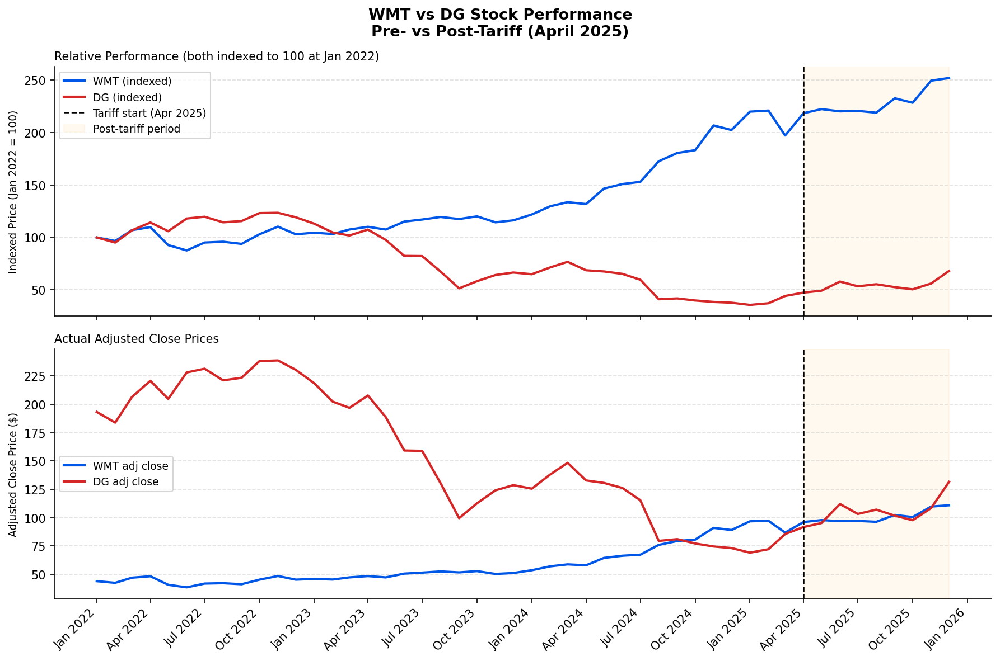

# Tariff Impact on U.S. Consumer Spending: A Retail Market Analysis

An end-to-end data analysis measuring how the April 2025 U.S. tariff expansion affected food prices, consumer confidence, and the divergent stock performance of two major discount retailers — Walmart (WMT) and Dollar General (DG).

---

## Business Problem

When broad tariffs took effect in April 2025, the immediate question for consumer-facing businesses was not whether prices would rise, but by how much — and which retailers were positioned to absorb or pass through the shock. This analysis was built to answer three questions:

1. How much did tariffs move the needle on food and apparel inflation?
2. Did consumer sentiment track those price changes, and how quickly?
3. Between Walmart and Dollar General — two retailers who compete directly for cost-conscious shoppers — which one held up better, and why?

The comparison period runs from **January 2022 through December 2025**, split at the April 2025 tariff announcement as the pre/post boundary.

---

## Key Findings

| Metric | Pre-Tariff Avg | Post-Tariff Avg | Change |
|---|---|---|---|
| Food CPI | 320.84 | 340.83 | **+6.2%** |
| Apparel CPI | 129.87 | 131.61 | +1.3% |
| Consumer Sentiment (UMich) | 65.53 | 55.29 | **-15.6%** |
| WMT Adj. Close | $57.60 | $100.94 | **+75.3%** |
| DG Adj. Close | $155.87 | $105.49 | **-32.3%** |

Food prices absorbed the heaviest tariff pass-through — a **+6.2% average increase** post-April 2025 — while apparel remained relatively insulated at +1.3%. Consumer sentiment fell sharply by **15.6 points**, consistent with households registering the grocery bill impact before it fully appeared in official CPI figures.

The retailer divergence is the starkest signal in the data. Walmart's stock gained **75.3%** in the post-tariff period while Dollar General shed **32.3%** — a **107-point spread** between two chains that nominally serve the same demographic. The gap points to structural differences in supply chain flexibility and private-label exposure rather than demand deterioration alone.



---

## Recommendation

**Overweight WMT relative to DG in a tariff-elevated environment.**

Walmart's scale gives it negotiating leverage with suppliers and the working capital to absorb short-term cost spikes without immediate margin compression. Its grocery mix — already the largest food retailer in the U.S. — positions it to capture volume from consumers trading down from mid-tier grocers. The data suggests the market has already begun pricing this in.

Dollar General's exposure is more precarious. Its customer base is disproportionately low-income and food-dependent, meaning it has limited ability to either raise prices or absorb costs. The -32% post-tariff stock move likely reflects both margin pressure and a forward-looking concern about demand destruction in its core segment.

---

## Tradeoffs & Limitations

**Stock price ≠ operational performance.** The WMT/DG gap captures market sentiment in the post-tariff window, not confirmed earnings impact. A more rigorous analysis would layer in gross margin trends and same-store sales data.

**Short post-tariff window.** The post-tariff period covers only April–December 2025 (nine months). Averages over a short window are sensitive to outliers and may not reflect a new steady state.

**Correlation, not causation.** The tariff announcement coincided with broader macroeconomic uncertainty. Isolating the tariff effect from concurrent variables (Federal Reserve policy, consumer credit tightening) would require a more controlled model.

**FRED data lag.** CPI series from the Bureau of Labor Statistics carry a publication lag of 3–6 weeks. The most recent months were forward-filled using the last published value, which slightly smooths the post-tariff spike.

---

## Tools & Data Sources

**Data**
- [FRED API](https://fred.stlouisfed.org/) — Food CPI (`CPIUFDNS`), Apparel CPI (`CPIAPPNS`), University of Michigan Consumer Sentiment (`UMCSENT`)
- [Alpha Vantage API](https://www.alphavantage.co/) — Monthly adjusted close prices for WMT and DG

**Stack**
- **Python** — data collection, cleaning, and analysis (`pandas`, `matplotlib`, `seaborn`, `fredapi`, `requests`, `python-dotenv`)
- **Tableau** — dashboard visualization

---

## How to Run

**1. Clone the repo and install dependencies**

```bash
git clone https://github.com/brianna-chau/tariff-consumer-analysis.git
cd tariff-consumer-analysis
pip install -r requirements.txt
```

**2. Set up API keys**

Create a `.env` file in the project root:

```
FRED_API_KEY=your_fred_api_key
ALPHAVANTAGE_API_KEY=your_alphavantage_api_key
```

Free keys: [FRED](https://fredaccount.stlouisfed.org/login/secure/) · [Alpha Vantage](https://www.alphavantage.co/support/#api-key)

**3. Run the pipeline in order**

```bash
# Pull raw data from APIs
python notebooks/01_data_collection.py

# Clean, merge, and engineer features
python notebooks/02_cleaning.py

# Run analysis and generate charts
python notebooks/03_analysis.py
```

Outputs land in `data/processed/`: `cleaned_data.csv`, `insights_summary.csv`, and `retailer_comparison.png`.
